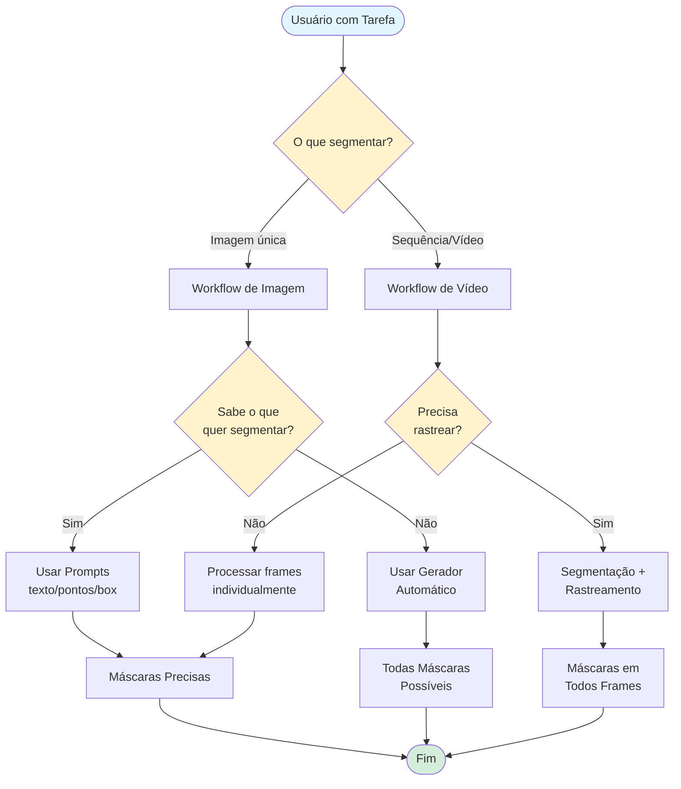
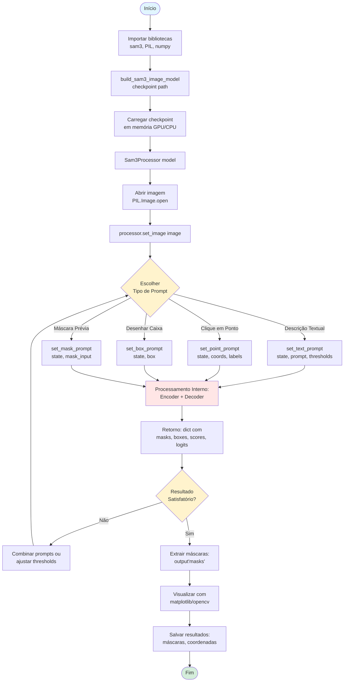
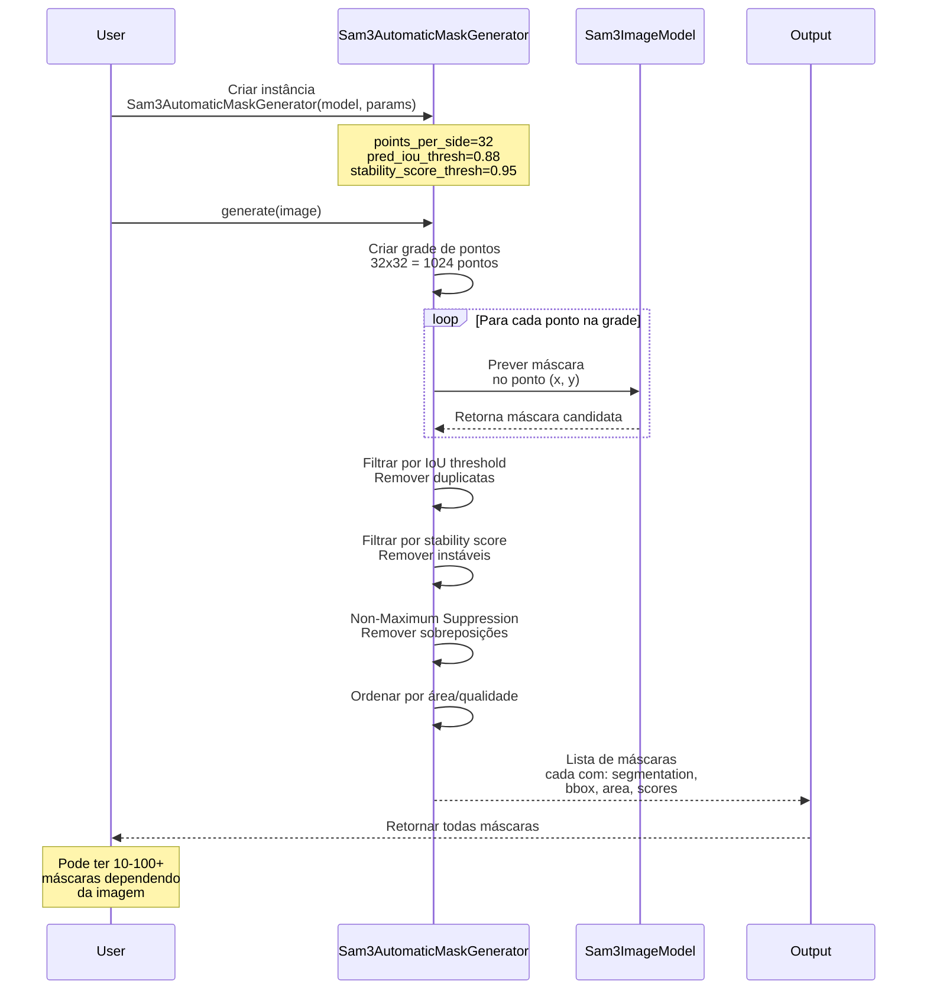
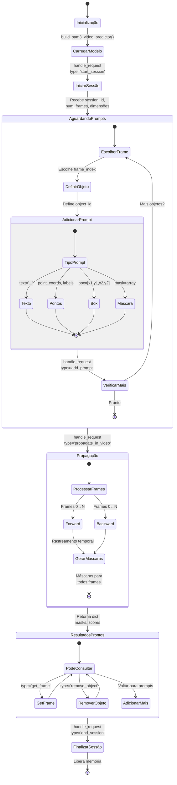
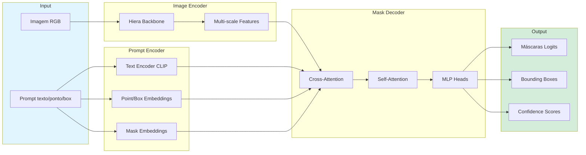
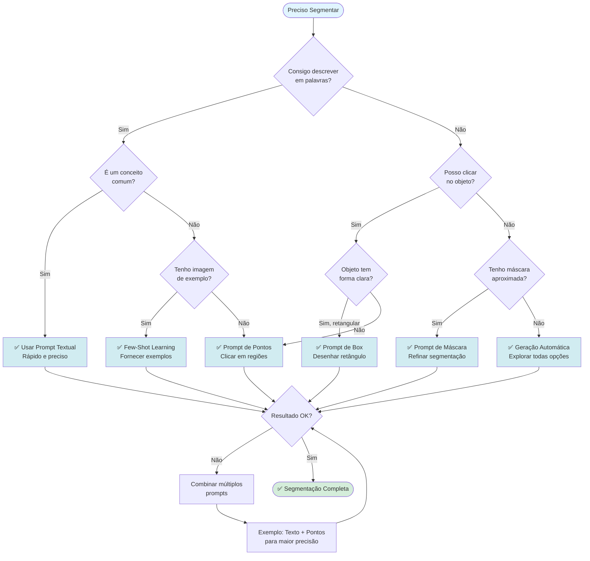
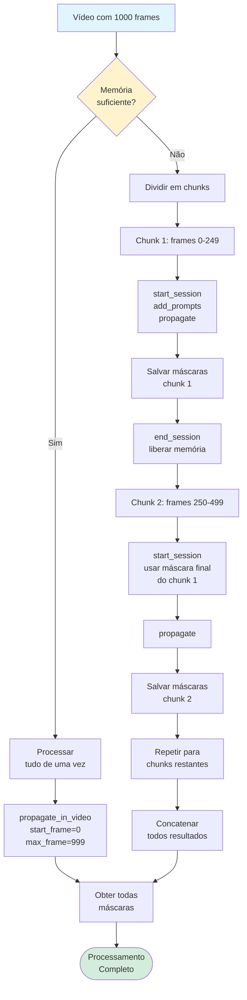

# SAM 3 - Fluxogramas Explicativos

## 1. Fluxo Geral - Decisão de Uso

---

## 2. Workflow Detalhado - Segmentação de Imagem

---

## 3. Workflow - Geração Automática de Máscaras

---

## 4. Workflow Detalhado - Segmentação em Vídeo

---

## 5. Arquitetura Interna - Processamento

---

## 6. Fluxo de Decisão - Escolha de Prompt

---

## 7. Pipeline de Vídeo - Rastreamento Temporal

```mermaid
gantt
    title Pipeline de Processamento de Vídeo
    dateFormat X
    axisFormat %L
    
    section Inicialização
    Carregar Modelo           :0, 100
    Iniciar Sessão           :100, 150
    Carregar Vídeo           :150, 250
    
    section Frame 0 (Anotação)
    Adicionar Prompt Obj 1   :250, 300
    Adicionar Prompt Obj 2   :300, 350
    Gerar Máscaras Iniciais  :350, 450
    
    section Propagação Forward
    Frame 1                  :450, 470
    Frame 2                  :470, 490
    Frame 3-10               :490, 650
    Frame 11-20              :650, 800
    
    section Propagação Backward  
    Verificação Frame 0      :800, 850
    Refinar se necessário    :850, 900
    
    section Pós-Processamento
    Suavização Temporal      :900, 1000
    Consistência de Máscaras :1000, 1100
    
    section Finalização
    Salvar Resultados        :1100, 1200
    Liberar Memória          :1200, 1250
```

---

## 8. Comparação de Métodos

```mermaid
graph TD
    subgraph "Prompt Textual"
        T1[Input: 'gato laranja']
        T2[Vantagens:<br/>✓ Rápido<br/>✓ Intuitivo<br/>✓ Vocabulário aberto]
        T3[Desvantagens:<br/>✗ Ambíguo às vezes<br/>✗ Depende de descrição]
        T1 --- T2
        T2 --- T3
    end
    
    subgraph "Prompt de Pontos"
        P1[Input: coords, labels]
        P2[Vantagens:<br/>✓ Muito preciso<br/>✓ Controle fino<br/>✓ Múltiplas regiões]
        P3[Desvantagens:<br/>✗ Manual<br/>✗ Trabalhoso em vídeo]
        P1 --- P2
        P2 --- P3
    end
    
    subgraph "Prompt de Box"
        B1[Input: x1,y1,x2,y2]
        B2[Vantagens:<br/>✓ Simples<br/>✓ Bom para objetos<br/>retangulares]
        B3[Desvantagens:<br/>✗ Menos preciso<br/>✗ Formas irregulares]
        B1 --- B2
        B2 --- B3
    end
    
    subgraph "Geração Automática"
        A1[Input: imagem]
        A2[Vantagens:<br/>✓ Zero esforço<br/>✓ Descobre tudo<br/>✓ Exploratório]
        A3[Desvantagens:<br/>✗ Muitos resultados<br/>✗ Mais lento<br/>✗ Precisa filtrar]
        A1 --- A2
        A2 --- A3
    end
    
    style T2 fill:#d4edda
    style P2 fill:#d4edda
    style B2 fill:#d4edda
    style A2 fill:#d4edda
    style T3 fill:#f8d7da
    style P3 fill:#f8d7da
    style B3 fill:#f8d7da
    style A3 fill:#f8d7da
```

---

## 9. Ciclo de Refinamento Iterativo

```mermaid
graph LR
    A([Primeira Tentativa]) --> B[set_text_prompt<br/>'pessoa']
    B --> C{Muitas detecções?}
    
    C -->|Sim| D[Refinar texto:<br/>'pessoa camisa azul']
    C -->|Não| E{Faltou alguma<br/>região?}
    
    D --> F[set_text_prompt<br/>mais específico]
    F --> E
    
    E -->|Sim| G[Adicionar ponto positivo<br/>na região faltante]
    E -->|Não| H{Incluiu regiões<br/>erradas?}
    
    G --> I[set_point_prompt<br/>coords foreground]
    I --> H
    
    H -->|Sim| J[Adicionar ponto negativo<br/>na região errada]
    H -->|Não| K{Bordas<br/>imprecisas?}
    
    J --> L[set_point_prompt<br/>coords background]
    L --> K
    
    K -->|Sim| M[set_mask_prompt<br/>para refinar]
    K -->|Não| N([✅ Resultado Final])
    
    M --> O{Melhorou?}
    O -->|Não| P[Ajustar thresholds<br/>box_threshold, text_threshold]
    O -->|Sim| N
    
    P --> B
    
    style A fill:#e1f5ff
    style N fill:#d4edda
    style C fill:#fff3cd
    style E fill:#fff3cd
    style H fill:#fff3cd
    style K fill:#fff3cd
    style O fill:#fff3cd
```

---

## 10. Gestão de Memória - Vídeo Longo

## Legenda de Cores

- 🔵 **Azul claro**: Início/Input
- 🟢 **Verde**: Fim/Sucesso
- 🟡 **Amarelo**: Decisões/Pontos de escolha
- 🔴 **Vermelho claro**: Processamento interno
- 🟦 **Azul**: Vantagens
- 🟥 **Vermelho**: Desvantagens